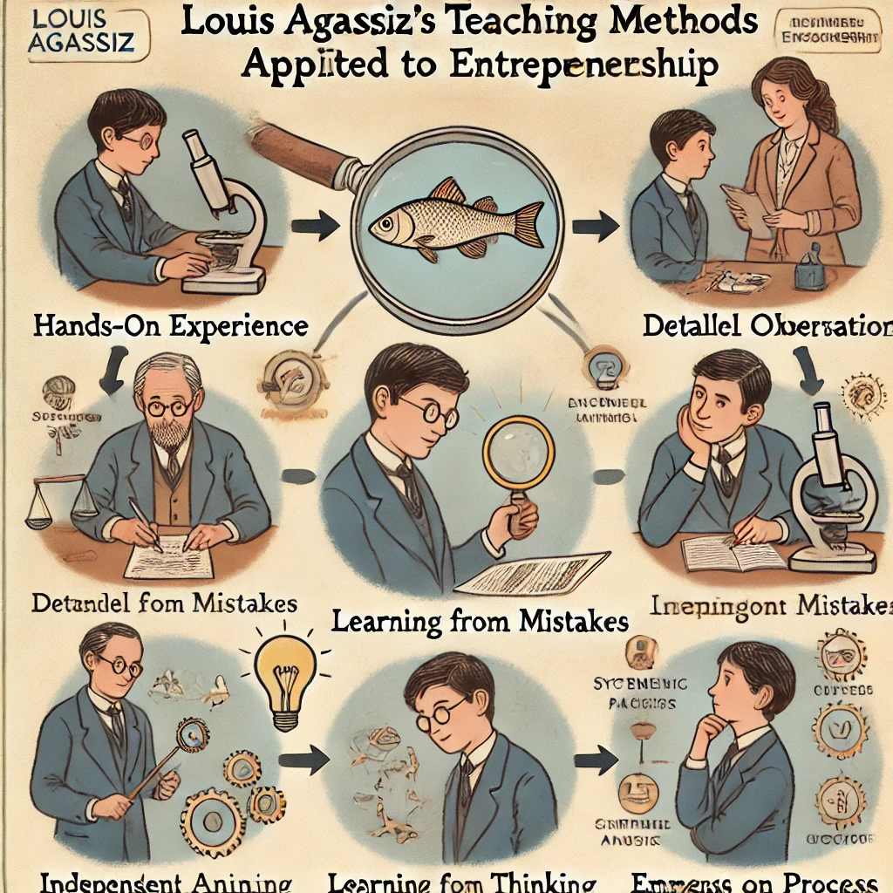
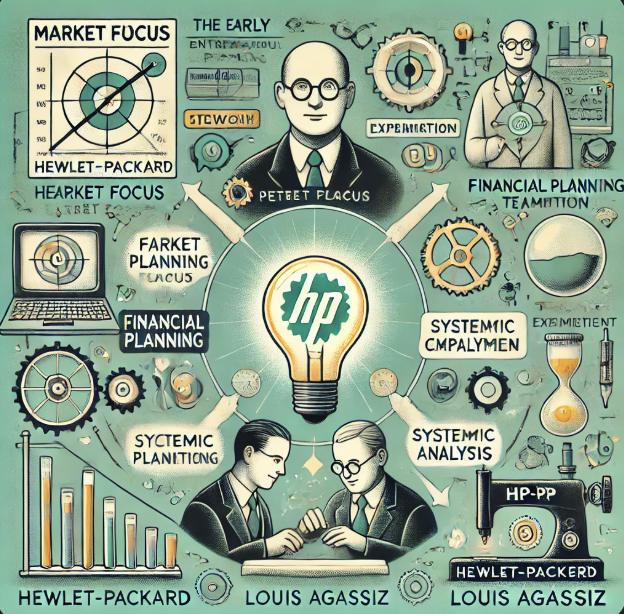

# EAS5450 HW 1 

Tony Wang

Jan 20, 2025

> *Note:* 
>
> - *I plan to record the assignments as blog in my website, and I use my answer as prompt into @DALL-E, GenAI image tool.* 
> - *Some questions, thinking is co-discussed with @ChatGPT and @NotebookLM *

## Q1. Study the short excerpt on “Louis Agassiz as a Teacher” 

Louis Agassiz is a renown 19th century professor of the natural sciences. He is known for having revolutionized research and learning methods in this country. 

His legacy, however, is tarnished by his controversial beliefs and the scientific racism implicit in some of his work. Notwithstanding his tarnished legacy, the application of his regimen of observational data gathering and analysis is important for entrepreneurial engineers. 

As you read this article, think about the relevance of Agassiz's method to the discipline of the high-tech entrepreneur. Be prepared to discuss this in class.

### Answer

Though Louis behaved poorly about belief and racism, his work and teaching methods are actually useful. 

We might summarize the key as **direct observation and deep analysis.**

**1. Hands-on Experience**
Louis encouraged students to work directly with specimens and find insights independently, just like how should us entrepreneurs understand our products and markets deeply on our own.

**2. Detailed Observation**
He required students to spend hours studying details like a fish's anatomy. This implies entrepreneurs must analyze market needs and customer pain points for long time. 

**3. Learning from Mistakes**

It's in fact same idea as Reinforcement Learning, where RL learns from failure, exploration but not fully punished. 

**4. Independent Thinking**
Rather than giving answers, Louis pushed students to draw their own conclusions. Exactly the same as the critical thinking needed in entrepreneurship.

**5. Systematic Analysis**
Louis taught students to break down tasks step by step. Entrepreneurs also plan and execute ventures systematically.

This is especially important for high tech system engineering, you must make sure each step in the system works correctly, then the overall accuracy would be high. 

All in all, Louis's methods highlight the value of observation, analysis, and independent problem-solving for high-tech innovators.

## Q2: The Innovator's DNA. 

Study the five “discovery skills” that distinguish visionary entrepreneurs. Think carefully about the relevance of the above Agassiz article to the findings of this article. What discipline and skills are common to both? Following advice from this article, what can you do to sharpen your personal innovation skills? 

### Answer

**5 Discovery Skills of Innovators**

- **Associating**: Connecting unrelated ideas across fields.

- **Questioning**: Challenging norms with "Why?", "Why not?", and "What if?".

- **Observing**: Paying attention to details and customer behavior.

- **Experimenting**: Trying out ideas via prototypes and pilots.

- **Networking**: Engaging diverse people to expand perspectives.

**Relevance of Agassiz Article**

As shown in Q1, the following 3 skills are quite in common with Agassiz's argument: 

- **Observing:** Innovators need to scrutinize common phenomena, like Agassiz emphasized close, long time observation of specimens.
- **Experimenting:** By working with specimens, students were actively trying out different ways of examining them and figuring out their feature on their own, similar to experimenting to see what insights emerge.
- **Questioning:** Agassiz did not offer answers, but rather encouraged students to ask questions to guide them in their own study. 

If I am required to rank my skill score out of 5, I will rank as following for Jan, 2025. 

- **Associating**:  4/5

- **Questioning**: 4/5

- **Observing**: 2/5

- **Experimenting**: 3/5

- **Networking**: 5/5

To raise the probability of success in entrepreneurship, both hard work and mind-opening are quite important. 

As stated in ZJU's school motto, *'Seeking Truth and Pursing Innovation'*, I need to spend more time, being patient for the idea / ongoing work. While it is also quite important to get things down fast, especially if you are working in a quite popular field: tons of people are doing same topic, and scoop is just daily meals for everyone.  

## Q3: “The New Venture”

This is a chapter from Peter Drucker's highly regarded and enduring book, Innovation and Entrepreneurship. As you read this chapter, think about the following study questions: 

1. **Who is Peter Drucker? Do a quick online search and familiarize yourself with “the world's greatest management thinker”and “the father of modern management.”** 

> Wiki: 
>
> Peter Ferdinand Drucker was an Austrian American management consultant, educator, and author, whose writings contributed to the philosophical and practical foundations of modern management theory.

2. **For the high-tech startup, what is the importance of Professor Drucker's analysis of the phrase “entrepreneurial management”?** 

According to Drucker,  entrepreneurial management is crucial for new venture. He argues that in a new business, there is no existing structure, unlike in an established enterprise where "management" is already in place. 

For a new venture, "management" needs to be actively created. This is particularly true for high-tech startups because radical innovations always require a new form of management in the history. 

He also states that a new venture may have a product or service and sales, but not necessarily a viable, operating, organized "present" in which people know what they are doing. The challenge is not merely about creating a new idea, but also creating a business to bring that idea to life.

3. **Professor Drucker underscores four key requirements for entrepreneurial management. What are they and why are they important?** 

   1. **Focus on the Market**: Start by identifying a customer need, not just building a product. Ask, "What market does our product serve?" instead of blaming others for taking market share.
   2. **Financial Planning**: Carefully manage cash flow and capital needs. Many ventures fail because income falls short, and expenses stack up.
   3. **Build a Strong Management Team Early**: No founder can do everything alone. Recruit capable people to take on responsibilities as the venture grows.
   4. **Founder's Commitment**: Success demands the founder's time, energy, and discipline. Founders must lead by example and trust others to help manage.

   These are crucial to avoiding typical startup failures like poor market fit, financial mismanagement, weak teams, or lack of dedication.

4. **Do you see any relationship with any of these four requirements and Louis Agassiz's teaching methods?**

- **Focus on the market** is similar to Detailed Observation
- **Financial Planning** is similar to systematic analysis
- **Founder's Commitment**  is similar to find Hands-On Experience and Independent Thinking

## Q4:  Familiarize yourself with the “EAS5450 Course Syllabus” posted on Canvas. Read the “Case Method Overview” posted in Canvas Files.

Done

## Q5: Hewlett Packard: Creating, Running, and Growing an Enduring Company case

> https://services.hbsp.harvard.edu/api/courses/1253131/items/698052-PDF-ENG/sclinks/ee25c546d4c360d71a3fbf2e3f152ef8

Think about the following study questions during your analysis of this case: 

1.  In our reading by Peter Drucker, we studied certain requirements for entrepreneurial management. Can the ultimate success of HP be attributed, in whole or in part, to Bill Hewlett's and Dave Packard's adherence to Professor Drucker's requirements? Explain. 
2. What other factors had a significant effect on the ultimate success of HP? 
3. What organizational structure and business processes did Bill Hewlett and Dave Packard create in their small company that allowed HP to evolve and grow? 
4. How did they run and grow the business? Were they simply “lucky” in creating a highly successful company? 
5. What did Dave Packard learn from his corporate job experiences prior to creating HP that where beneficial to HP's success? Be prepared to discuss these articles and case in class. 

### Answer 

**1. HP's Success surely follow Drucker's Principles**

- **Focus on Market**: Targeted technical niches to add value without competing with major players.
- **Financial Foresight**: Used a “pay-as-you-go” approach, avoiding long-term debt.
- **Top Management Team**: Created a collaborative culture and promoted from within.
- **Founder's Commitment**: Institutionalized values through the "HP Way" and hands-on leadership.

**2. Other Factors**

- **The HP Way**: Focus on trust, teamwork, and open communication.
- **Mentorship**: Frederick Terman's guidance and network support.
- **Innovation**: Commitment to groundbreaking products and employee development.
- **Strategic Alliances**: Partnerships with Stanford and industry ties.
- **Adaptability**: Expanded globally and diversified product lines.

**3. Organizational Structure & Processes**

- **Semi-Autonomous Divisions**: Allowed entrepreneurial culture while scaling.
- **MBWA**: Managers actively engaged with employees and operations.
- **Open Door Policy**: Encouraged trust and communication.

**4. Strategy vs. Luck**
 Success was driven by strategic focus, innovation, strong leadership, and adaptability, though early mentorship and location in Silicon Valley helped.

**5. Packard's GE Lessons**

- **Trust**: Rejected rigid, mistrustful management practices.
- **Personal Involvement**: Emphasized attention to detail via MBWA.
- **Communication**: Promoted open dialogue to foster collaboration.

HP's lasting success stemmed from values-driven leadership, strategic decisions, and a culture of innovation and trust.

## Q6  Case Method Overview

write a concise 2-page essay addressing the question: 

Can the early success of Hewlett and Packard be attributed to their adherence to any of Peter Drucker's four requirements for “entrepreneurial management” and the lesson of Louis Agassiz? Explain. 

### Early Success of HP from Drucker's Principles + Lessons from Agassiz

The early success of Hewlett-Packard (HP) can largely be attributed to their adherence to Peter Drucker's four requirements for entrepreneurial management, complemented by insights from Louis Agassiz's teaching methods. Both frameworks acted as the "circuit board" for HP's structured innovation, enabling them to engineer a robust foundation for growth and sustainability.

#### Drucker's Four Requirements for Entrepreneurial Management

1. **Focus on the Market**:
    Bill Hewlett and Dave Packard's approach was market-first, akin to designing a product by reverse-engineering customer needs. They targeted technical niches that made "important contributions to science, industry, and human welfare," avoiding direct competition with industry giants. As Drucker noted, "The aim of marketing is to know and understand the customer so well that the product or service fits him and sells itself." HP's strategic alignment with specific markets embodied this principle, ensuring value creation and differentiation.
2. **Financial Foresight**:
    HP's financial prudence was their "voltage regulator," ensuring stability amidst uncertainty. Their "pay-as-you-go" model emphasized organic growth from earnings rather than relying on debt, mirroring Drucker's warning that "cash flow matters as much as your big idea." This foresight allowed them to navigate cash flow challenges without overloading their "circuit."
3. **Building a Top Management Team Early**:
    Rather than assembling a rigid hierarchy, HP fostered a "distributed system" of collaboration. The HP Way, rooted in trust, mutual respect, and empowerment, created an environment where employees were more "co-creators" than subordinates. Their decision to establish semi-autonomous divisions in 1957 acted as "parallel processors," maintaining agility and innovation as the company scaled—a clear embodiment of Drucker's call for building a competent, scalable management team.
4. **Founder's Personal Commitment**:
    Hewlett and Packard's commitment was the "power source" driving the organization's vision and culture. They actively engaged in daily operations, institutionalizing values through "The HP Way." As Drucker observed, "Unless commitment is made, there are only promises and hopes…but no plans." Their dedication ensured the company's ethos permeated every decision, from product development to employee welfare.

#### Lessons from Louis Agassiz

HP's methodologies also resonate with Agassiz's principles of observation, experimentation, and systematic analysis—the "feedback loop" essential to iterative innovation.

- **Observation**: Agassiz's insistence on close observation parallels HP's meticulous attention to customer needs and market demands. Hewlett and Packard's ability to identify opportunities was akin to "scanning the data" to extract meaningful insights.
- **Experimentation**: Agassiz's hands-on inquiry found echoes in HP's "test bench" culture, where trial-and-error refined both products and processes. This willingness to prototype and iterate was central to HP's success in developing innovative and practical solutions.
- **Systematic Analysis**: Agassiz's methodical dissection of complexity mirrored HP's structured problem-solving approach. From financial discipline to their semi-autonomous division model, HP treated challenges as "modular designs" that could be analyzed and optimized individually.

#### Integration of Drucker and Agassiz's Principles

The fusion of Drucker's strategic imperatives with Agassiz's observational rigor formed HP's "operating system." Drucker provided the "macro-level" framework for market focus, financial planning, team building, and commitment, while Agassiz's methods reinforced the "micro-level" disciplines of inquiry, experimentation, and systematic execution. This integration equipped HP to adapt to challenges, innovate consistently, and maintain a collaborative culture.

#### Conclusion

The early success of Hewlett and Packard was no accident. By adhering to Drucker's principles and embracing Agassiz's disciplined methods, they engineered a company that thrived on innovation, strategic foresight, and a culture of trust. Their ability to align market needs, financial stability, and employee empowerment with a systematic, iterative approach solidified HP as a model of enduring excellence in entrepreneurial management. Just as a well-designed circuit achieves efficiency and reliability, HP's integration of these principles ensured its early and lasting success.